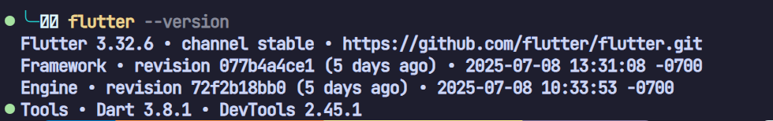
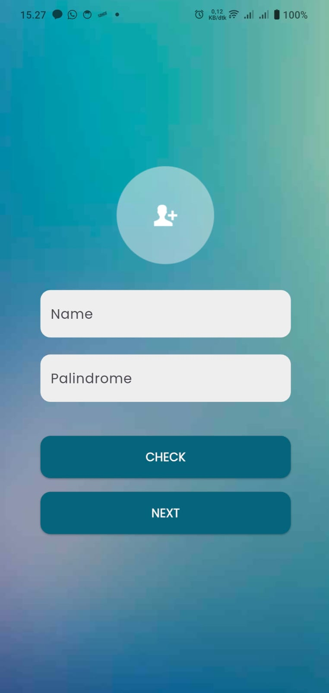
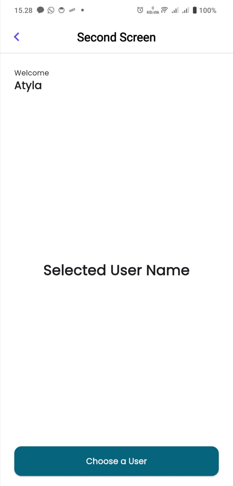
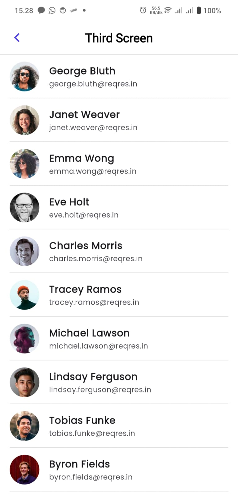
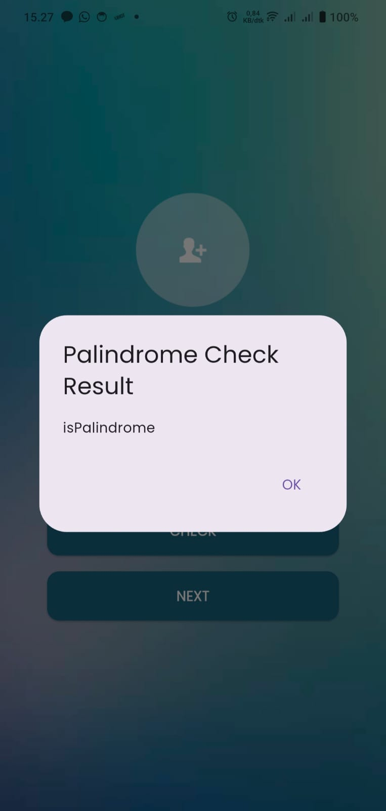
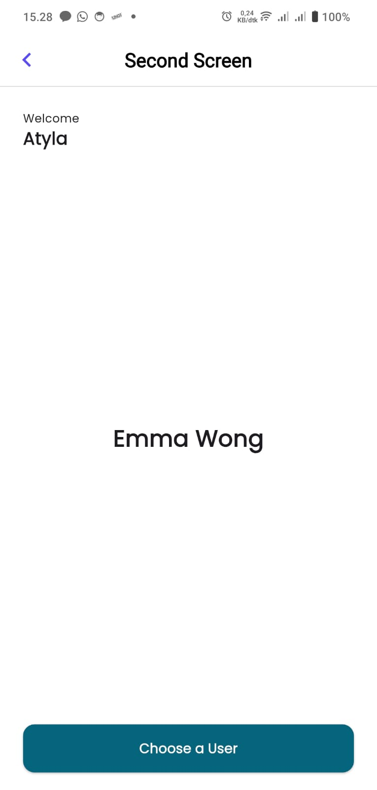

# Suitmedia Mobile Developer Intership Submission
Aplikasi Flutter ini dibuat sebagai bagian dari proses seleksi. Aplikasi ini terdiri dari tiga layar utama dengan fungsionalitas untuk pengecekan palindrom, menampilkan pengguna yang dipilih, dan menampilkan daftar pengguna dari API.

## Data Mahasiswa
| Keterangan | Informasi |
| :--- | :--- |
| **Nama** | Atyla Azfa Al Harits |
| **NIM** | 19230825 |
| **Universitas**| Universitas Bina Sarana Informatika |
| **Email** | damsadam78@gmail.com |

## Struktur Folder (MVC)
```bash
lib/
├── main.dart
│
├── controllers/
│   ├── palindrome_controller.dart
│   └── user_controller.dart
│
├── models/
│   └── user_model.dart
│
└── views/
    ├── first_screen.dart
    ├── second_screen.dart
    └── third_screen.dart
```
## Versi Flutter


## Library yang Dipakai
Beberapa library yang dipakai pada aplikasi:
<ul>
    <li>Google Fonts</li>
    <li>Http</li>
    <li>Cuppertino Icons</li>
    <li>Provider</li>
</ul>

## Screenshot Aplikasi
<p align="center">
  
  
  
  
  
  
</p>
